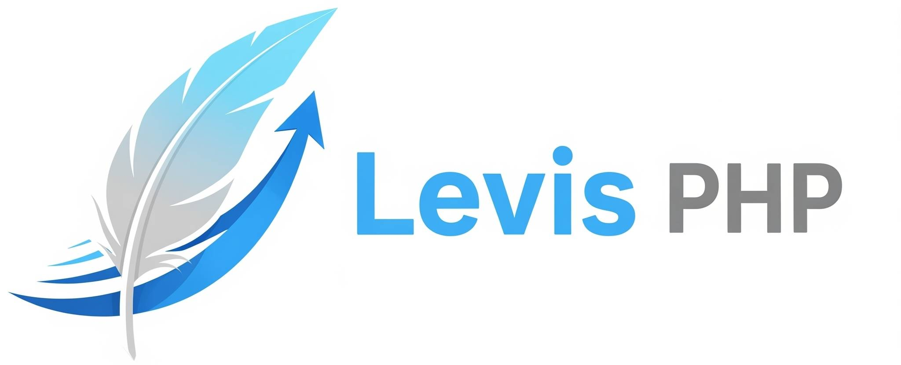

## 概要
Apache・PHP 8.3+・MySQLで動作する最低限の機能を備えた軽量フレームワークです。

テンプレートエンジンに[Twig](https://twig.symfony.com)

マイグレーション機能に[schemalex](https://github.com/schemalex/schemalex)を使用しています。

## 動作要件
- PHP 8.3 以上
- Apache (mod_rewrite)
- MySQL

## 使い方
1. Levisディレクトリを配置します。
1. `composer install` を実行します。
1. Levis/libs/config.php 内のデータベースへの接続設定を修正します。
1. Levis/libs/twig_extension.php のAPP_URLを修正します。
1. Levis/api/controllers/ 以下にコントローラーを配置します。
1. アクセスできるか確認し、OKなら使用可能です。
